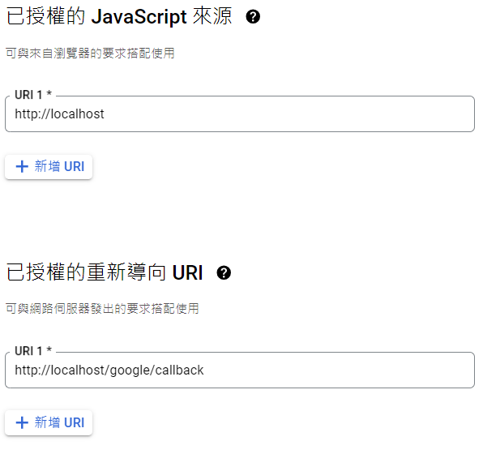

# Document Center Backend

## Api GateWay
First, set the environment in api-gateway/auth/.env
```txt
GOOGLE_CLIENT_ID=
GOOGLE_SECRET_KEY=

JWT_SECRET=
```
* JWT_SECRET is just a random number used in local server.
* GOOGLE_CLIENT_ID, GOOGLE_SECRET_KEY: goto https://console.cloud.google.com/apis/credentials, add a new credential with type "OAuth 2.0 Client ID"

Make sure that your information are looked like above image.

## Image Service

## Documents Service