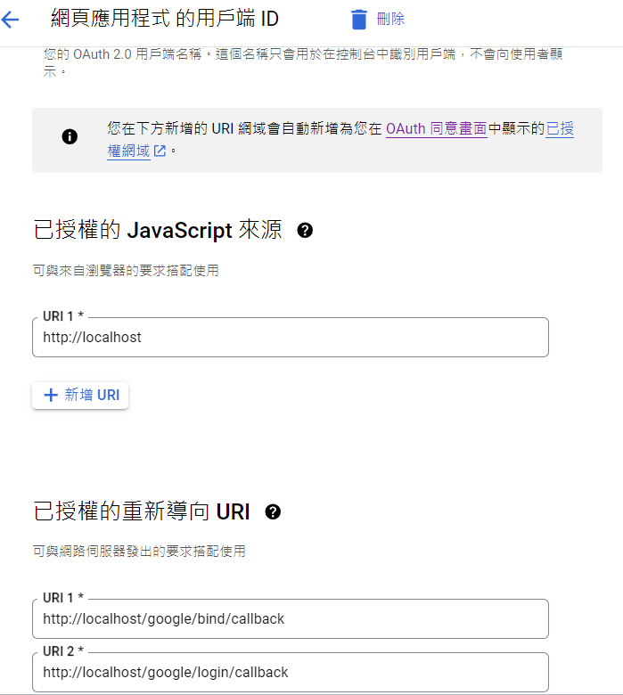

# Auth Service

Utilize Google OAuth 2.0 to provide basic third-party login functionality while implementing JWT authentication.

## Before Building
First, set the environment variables in `api-gateway/auth/.env` as follows:

```txt
GOOGLE_CLIENT_ID=
GOOGLE_SECRET_KEY=

JWT_SECRET=
```
* `JWT_SECRET` is a randomly generated string used for local server authentication.
* For `GOOGLE_CLIENT_ID` and `GOOGLE_SECRET_KEY`, visit Google Cloud Console and add a new credential with the type "OAuth 2.0 Client ID".

Ensure that your credentials match the setup shown in the following image:



## API SPEC
[API_SPEC](API_SPEC.md)